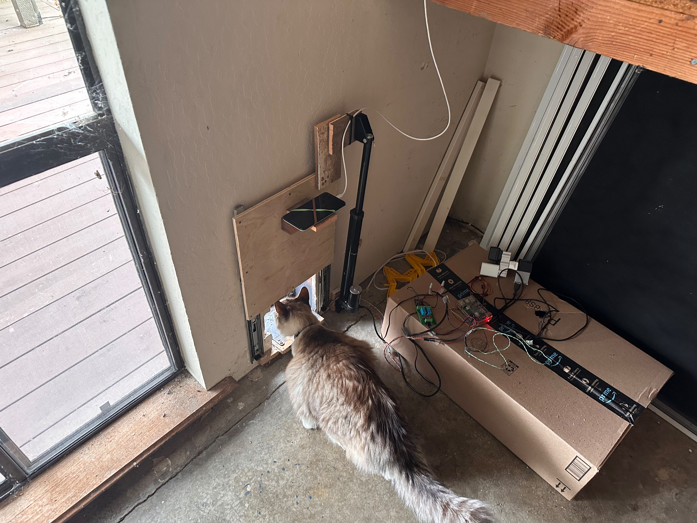

# Cat door


The task at hand: I needed a racoon proof cat door for my garage - Cheap amazon catdoor (even the RFID ones) do not work because eventually racoons break through them and get to the cat food.
My area has a lot of racoons - A vertical cat door exists, it was about 600$ last time I checked.

Solution: A Raspberry Pi controller for a actuator based vertical door
The cat carries a 1$ magnet - The detector, a very cheap magnetic field reader (MLX90393) has the advantage over RFID to have great range. In order for RFID to get range you needs a big antenna. No space and time to do this.

A **slight** complication: My cat (we call him bigcat) likes to hang at the door  (see pic below)
Given the actuator was a cheap, non custom made actuator from amazon, it is very powerfull. So if bigcat starts sleeping in the tunnel (in that case the magnetic field will stabilize) there is no way to know that the door will not "guillotine" the cat...
Before you ask: cheap IR detector is a pain and don't have, afaik wide view (I tried).

Solution 2: an old android phone with an app installed on it. Can be piloted by the RPI to take picture before closing the door (when the PI detects no magnetic field change) - On top of that, a custom made, CNN based binary classifier, to detect if there is obstruction on the closing path of the door.

The Pi controls all the logic, the mortor, the magnet sensor, the phone camera and finally the obstruction model.

A picture is worth a 1000 words:



## Using the door

The current installation uses a Raspberry Pi 3 running 64-bit Raspberry Pi OS
and a Nexus 5X camera. The Pi runs the controller and website as the
`catdoor.service` systemd service.

Open **[picat.local:8080](http://picat.local:8080)** on the local network.

| Control | What it does |
|---|---|
| **Open** | Opens the door and holds it open until Close, a schedule boundary, or restart. |
| **Close** | Clears the open hold and requests a fresh photo and obstruction check before closing. |
| **Force close (skip inference)** | Closes without a photo or obstruction check and clears the open hold. |
| **Take photo / Latest photo** | Requests a fresh capture / displays the latest upload. |
| **Run inference** | Checks a fresh photo without moving the door. |
| **Phone status** | Requests Android battery temperature, charge, and app CPU usage in Pull mode. |
| **Activity graph** | Shows activity inferred from magnet events, with current and archived log views. |

Both Close controls return to automatic operation: the magnet or an active
keep-open schedule can reopen the door. Force close is ignored while a movement
or closing check holds the movement lock. The displayed position is the
controller's commanded state; there is no position sensor.

### Automatic operation

The collar magnet triggers opening. The magnetic sensor periodically recalibrates
its baseline. Before automatic closing, the Pi requests a fresh phone photo and
checks it with the obstruction model. Closing requires a clear result and a final
check of the schedule, recent sensor activity, and minimum-open time.

An obstruction or failed check keeps the door open. The whole photo/inference
check has a **40-second timeout**; errors retry after **5 seconds**, and late
results are discarded. A permanently stuck inference worker needs a service
restart. There is no timeout that forces the door closed.

**Starting or restarting the service lowers the door without an obstruction
check to establish its closed position.** Web controls become available after
that lowering and settling cycle. Restarting also clears manual holds.

## Phone camera

Install and configure the [Android app](android/README.md) or
[iPhone app](ios/README.md). Use `http://picat.local:8080` as the server address
(`http://picat:8080` or the Pi's LAN IP also works if that is what the phone resolves).
Frame the doorway, select **Pull**, and tap **Start**.

- **Pull** is required for automatic obstruction checks. The phone waits on an
  HTTP long-poll connection, then captures and uploads a new photo when requested.
- **Push** takes periodic photos for collection. The web UI can change a running
  Android app's mode and Push interval, from 1–60 seconds. Changes apply after any
  current capture finishes. The iPhone app uses a 10-second Push interval.

Android continues with the screen off. Its crop has independent width, height,
and position controls; stop capture to adjust them, then start again. The rear
light is used during captures from 18:00 through 07:59, using phone local time.
The iPhone app must remain active. See the app READMEs for installation, battery
settings, builds, and capture details.

Photos are uploaded to `camera_images/` on the Pi, not saved to the phone's photo
library. Pull uploads trigger retention cleanup, keeping the latest 10,000
images by default; Push uploads accumulate until a Pull cleanup. Copy training
examples elsewhere before cleanup removes them.

## Configuration

Edit [`door.py`](door.py), then restart the service to load changes.

| Setting | Purpose |
|---|---|
| `KEEP_OPEN_START`, `KEEP_OPEN_END` | Daily keep-open interval in Pi local time, using `HH:MM`. An end at or before the start disables scheduling; intervals do not wrap overnight. |
| `OPEN_MIN_TIME` | Minimum time after opening and settling before automatic closing is eligible. |
| `CLOSE_CHECK_INTERVAL` | Delay after a completed classification before another automatic check. |
| `CLOSE_CHECK_RETRY_DELAY` | Delay after a photo or inference error. |

A schedule boundary clears the website hold. The current schedule values and
motor travel times are in the code; travel times must match the mechanism.
`CLOSE_CHECK_TIMEOUT` is in [`obstruction_checker.py`](obstruction_checker.py),
and image retention is controlled by `KEEP_IMAGES_AFTER_PULL` in
[`door_camera.py`](door_camera.py).

## Running and maintaining the Pi

The repository is at `/home/pi/door`; its Python environment is at
`/home/pi/door-venv`.

```sh
systemctl status catdoor              # Service state
sudo systemctl restart catdoor        # Reload code/configuration; lowers the door
sudo systemctl stop catdoor           # Stop before running the controller manually
tail -f ~/door.log                    # Door events and inference results
tail -f ~/door-script.log             # Full output, including HTTP and Python errors
```

The service starts at boot and restarts after a process exit. It also runs the
website, so no separate web process is needed. The website/API has no login and
is intended for the local network.

### Installation

| Hardware | Connection |
|---|---|
| MLX90393 magnetic sensor | I²C |
| Motor relay | BCM GPIO 27, inverted polarity |
| Direction relay | BCM GPIO 17 |
| Optional break-beam sensor | BCM GPIO 22; disabled in normal startup |
| Phone camera | Wi-Fi |

Enable I²C and give the service user GPIO/I²C access. With the repository at
`~/door`, prepare the environment and install the included service:

```sh
python3 -m venv ~/door-venv
~/door-venv/bin/python -m pip install --upgrade pip
~/door-venv/bin/python -m pip install numpy RPi.GPIO adafruit-blinka adafruit-circuitpython-mlx90393
~/door-venv/bin/python -m pip install -r ~/door/obstruction_model/requirements.txt \
  --extra-index-url https://download.pytorch.org/whl/cpu
sudo cp ~/door/catdoor.service /etc/systemd/system/catdoor.service
sudo systemctl daemon-reload
sudo systemctl enable --now catdoor
```

### Troubleshooting

| Symptom | What to check |
|---|---|
| Photo request times out | Phone power, Wi-Fi, server address, Pull mode, and whether capture is started. |
| Door stays open | Website hold, schedule, sensor activity, and the check result in `~/door.log`. |
| Repeated “previous photo/inference check is still running” | The worker is stuck; restart the service, noting the startup lowering described above. |
| Website unavailable just after restart | Wait for startup lowering and settling to finish. |
| Camera light stays off during daytime | The light follows the phone's 18:00–08:00 night schedule. |

## Model and development

The Pi checks the exact photo requested for each closing attempt and reuses a
cached PyTorch classifier. Model scores are not calibrated probabilities, and
successful tuning does not establish performance on new scenes. Model details,
limitations, and the command for classifying a saved photo are in the
[obstruction model documentation](obstruction_model/README.md).

[Training runs on the Mac](training/README.md), with images and generated runs
under `~/Documents/code/CATDOOR_TRAINING/`. Training does not replace the deployed
weights automatically. A separate [scratch CNN experiment](scratch_cnn/README.md)
is also included.

| Code | Responsibility |
|---|---|
| [`door.py`](door.py) | Hardware, movement, schedules, and automatic control. |
| [`door_web.py`](door_web.py), [`door_ui.py`](door_ui.py) | Website and local HTTP API. |
| [`door_camera.py`](door_camera.py), [`pull_photo.py`](pull_photo.py) | Photo storage, phone settings, and capture requests. |
| [`obstruction_checker.py`](obstruction_checker.py) | Fresh-photo checks, model warm-up, and timeout handling. |
| [`door_analytics.py`](door_analytics.py) | Activity reports from event logs; counts are inferred visits, not measured passage or direction. |

For scripts, the API accepts JSON POSTs. For example, this requests an ordinary
camera-checked close; HTTP success alone does not confirm the door has closed:

```sh
curl -H 'Content-Type: application/json' -d '{}' http://picat.local:8080/close
```

Run the controller tests with fake hardware and clocks:

```sh
cd ~/door
~/door-venv/bin/python -m unittest discover -s . -p 'test_*.py' -v
```
